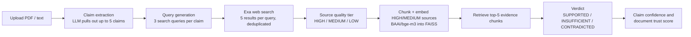

# ARA: Claim-Level Verification for RAG

ARA checks each factual claim in a document against independently retrieved web evidence, instead of trusting whatever the retriever returns. It is the code behind:

> Singh, P. (2026). "A Claim-Centric Multi-Source Verification Architecture for Reducing Hallucinations in Retrieval-Augmented Generation." *Amity Journal of Computational Sciences*, Vol. 10, Issue 1. [Read the paper (PDF)](https://img.amizone.net/AzureFileHandler.ashx?FileName=amitywebsite/userfiles/aijem/a30ec572.pdf)

(The project began as "Agentic Research Assistant", which is where the name comes from.)

## How it works



- **Pipeline:** LangGraph (`graph.py`) with separate chat, summarize, and verify graphs, served through a Chainlit UI (`app.py`).
- **LLMs:** `gpt-oss-120b` on Cerebras for verification (temperature 0), Kimi K2 on Groq for summarization (`llm.py`).
- **Source tiers** (`tools.py`): arXiv, Nature, ScienceDirect are HIGH; `.edu`, `.gov`, GitHub are MEDIUM; everything else is LOW. Only HIGH and MEDIUM sources enter the evidence index.
- **Verdict policy:** when evidence is partial or ambiguous, the verifier must answer INSUFFICIENT rather than guess.
- **Document verdict:** any CONTRADICTED claim rejects the document; any INSUFFICIENT claim flags it for manual check.

## Results

The evaluation set has 496 claims extracted from scientific papers (mostly arXiv), each hand-labeled SUPPORTED, INSUFFICIENT, or CONTRADICTED (`testing/labeled_dataset_clean.json`). The baseline is a standard RAG verifier that retrieves from a FAISS index of the source papers and uses the same LLM.

Results from the paper, on all 496 claims:

| Metric | ARA | Baseline RAG |
|---|---|---|
| Unsupported claims labeled SUPPORTED | **56** | 289 |
| Accuracy | 61.09% | 40.52% |
| Macro F1 | 0.377 | 0.210 |

So ARA marks about 80% fewer unsupported claims as supported. The paper reports this as a "hallucination rate" of 11.29% vs 58.27%, which divides by all 496 claims. Divided by the 302 claims that are actually unsupported, it is 18.5% vs 95.7%.

Things to keep in mind:
- Always predicting INSUFFICIENT would get about 60% accuracy on this set, so accuracy alone says little. The main result is the drop in false "supported" labels.
- ARA is conservative. It confirms only 65 of the 194 truly supported claims, while the baseline confirms 191.
- There are only 2 CONTRADICTED claims, so these results say nothing about contradiction detection.
- The baseline retrieves from the source papers themselves, while ARA searches the open web. The comparison measures the value of independent evidence, not of a better retriever over the same corpus.
- The paper describes Tavily for web search. This code uses Exa.
- `testing/evaluation/` holds the saved per-claim runs from this repo (389 ARA rows, 496 baseline rows).

## Setup

Developed with Python 3.13.

```bash
git clone https://github.com/DarkMatter1217/ARA.git && cd ARA
python -m venv .venv && source .venv/bin/activate
pip install -r requirements.txt
cp .env.example .env    # then add your keys
chainlit run app.py
```

You need API keys for Cerebras, Groq, and Exa (see `.env.example`).

## Reproducing the evaluation

Run from the repository root:

```bash
# ARA on the first 20 labeled claims (appends to testing/evaluation/ara_results.csv)
PYTHONPATH=.:testing python -c "from experiment_runner import run_experiment; run_experiment(model_config='full_ara', limit=20)"

# Baseline RAG (needs the document index in data/document_faiss/)
PYTHONPATH=.:testing python -c "from experiment_runner import run_experiment; run_experiment(model_config='baseline_rag', limit=20)"

# Metrics
PYTHONPATH=.:testing python -c "from compute_metrics import compute_metrics; compute_metrics('full_ara')"
```

`testing/` also contains calibration (`calibration_analysis.py`), determinism (`determinism_analysis.py`), and paired t-test (`statistical_tests.py`) scripts.

## Repository layout

```
app.py              Chainlit UI (chat / summarize / verify modes)
graph.py            LangGraph graphs, claim confidence, document trust score
agents.py           Claim extraction and verification agents
tools.py            Exa search, source tiers, FAISS evidence store
llm.py              Cerebras and Groq clients
preprocessing.py    PDF text cleaning and chunking
prompts.py          Prompt templates
testing/            Dataset construction, experiment runner, analysis scripts, results
```
